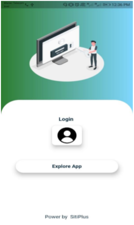
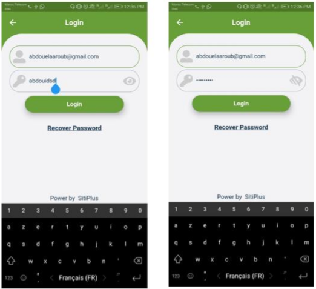
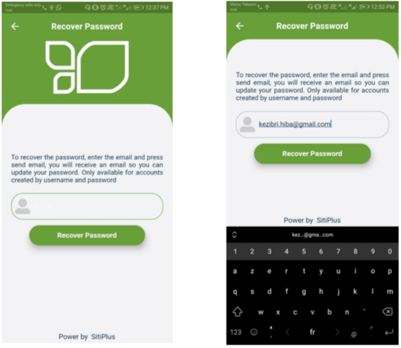
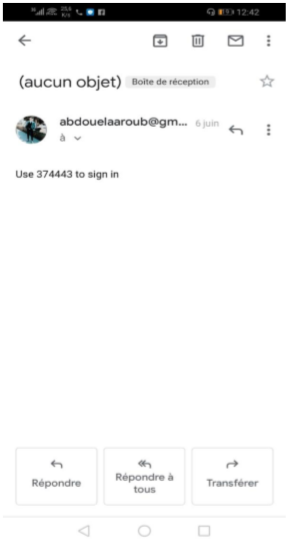
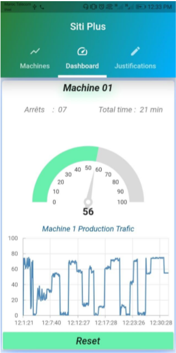
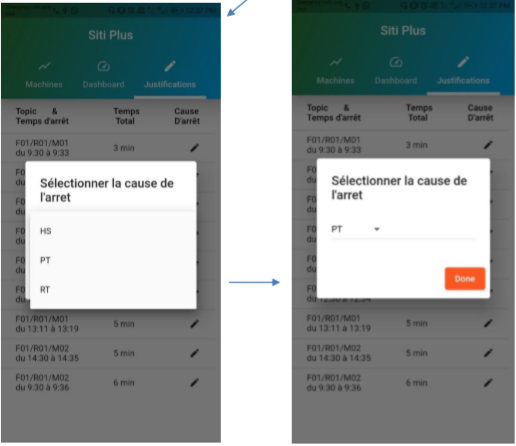
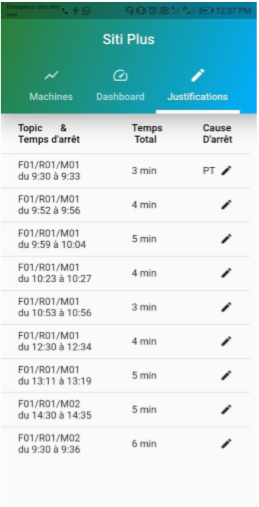
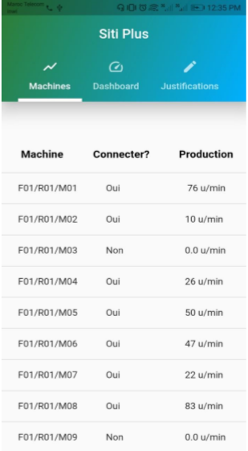

# Stage de fin d'étude: Monitoring d’une chaine de  production (REST API / Application mobile )
Du 25 Avril au 5 Juin 2021

## Sujet
L’objectif principal de ce travail du stage de fin d’étude consiste à automatiser le monitoring d’une chaine de production de thé pour notre client Siti tea. Dans ce projet, nous avons  développé une application mobile qui suit les unités produites de thé chaque minute ainsi que la détection des arrêts des machines en temps réel  que l’employé va les justifier.  Cette justification va être ensuite utilisée pour prédire prochainement l’arrêt automatiquement.  

## Outils utilisés
Nous avons utilisé comme outils Python-Flask, MQTT-Client, MongoDB et flutter.

## A quoi ressemble notre application mobile

### Acceuil

### S'authentifier

### Recuperer le mot de passe

### Tableau de bord

### Justification des arrets

### tableau des machines

**Elaaroub Abdellah & Kezibri Hiba**

